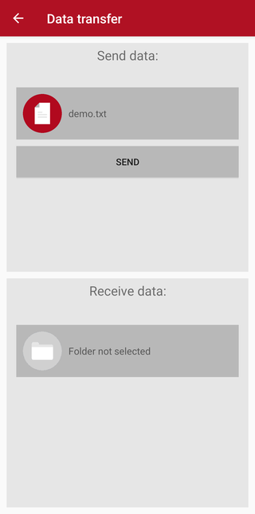
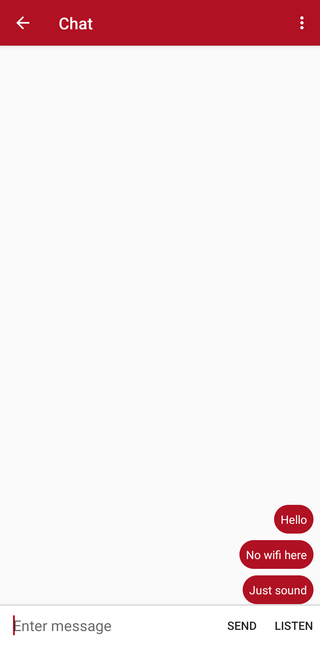
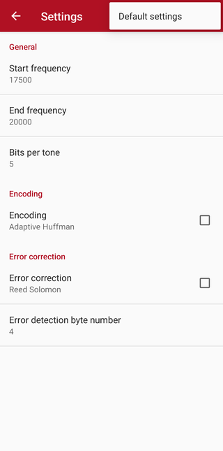

## Data Over Sound
#### Transfer data with sound waves between Android devices

  
  
  

### Description
*   Chat or send/receive various data.
*   No need for internet wifi or cellular network, just speakers and microphone.
*   Data is transfered using sound waves on frequencies adult human ear can't hear.

### More about project
*	Uses frequency modulation (key-shifting) to send data.
*	Encoding done with adaptive Huffman.
*	Error correction done with Reed Solomon's algorithm.

**[Download the APK (latest release)](https://github.com/MrLaki5/Data-over-sound/releases/latest/download/app-debug.apk)**
